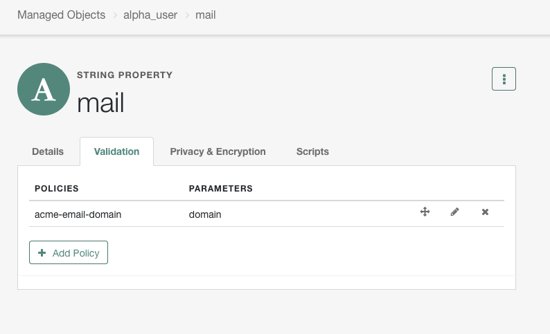
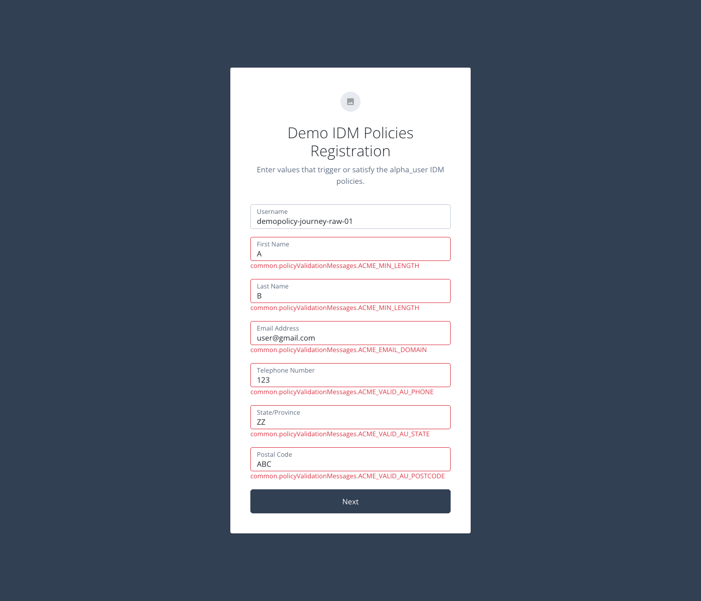
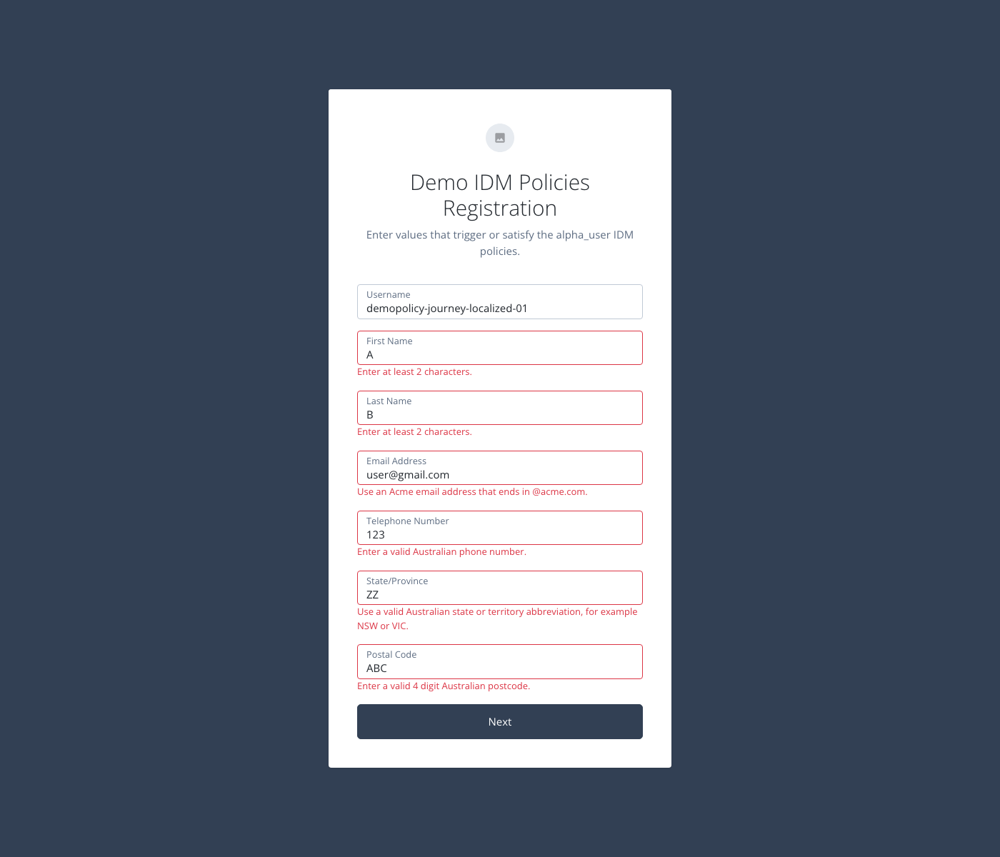

# AIC IDM Custom Policy Validation

## Goal

Customers often need custom IDM validation policies to enforce business rules, but these policies are not currently supported natively in AIC. This solution demonstrates a way to achieve them using mostly out-of-the-box behaviour. The intention is to keep IDM as the source of truth for validation and limit custom work to a small, well-defined configuration surface in `config/policy` and related settings.

The demo uses:

- `config/policy` for the custom policy registry
- `managed/alpha_user` for policy attachment
- `DemoIDMPoliciesReg` in the `alpha` realm for browser validation
- `uilocale/en` to translate raw policy keys into friendly hosted-page messages

The sample assets in this repo are:

- [samples/sample-policy.js](samples/sample-policy.js)
- [samples/config-policy.json](samples/config-policy.json)
- [samples/managed-alpha-user-properties.json](samples/managed-alpha-user-properties.json)
- [samples/uilocale-en.json](samples/uilocale-en.json)

## Step 1: Configure `config/policy`

Author the JavaScript in [samples/sample-policy.js](samples/sample-policy.js). Each policy is written in readable form with:

- one `addPolicy(...)` call
- one matching function such as `acmeEmailDomain(...)`

IDM does not store those as multi-line source files inside `config/policy`. For deployment, each `addPolicy(...)` call and function body must be flattened into a single JavaScript string entry under `globals.additionalPolicies`. The deployed example is [samples/config-policy.json](samples/config-policy.json).

Typical deployment call:

```http
PUT /openidm/config/policy
Content-Type: application/json
Authorization: Bearer <access_token>
```

```json
{
  "_id": "policy",
  "additionalFiles": [],
  "resources": [],
  "globals": {
    "additionalPolicies": [
      "addPolicy({\"policyId\":\"acme-email-domain\",\"policyExec\":\"acmeEmailDomain\",\"validateOnlyIfPresent\":true,\"policyRequirements\":[\"ACME_EMAIL_DOMAIN\"]}); function acmeEmailDomain(fullObject, value, params, property) { var domain; var normalizedValue; if (value === null || typeof value === \"undefined\" || String(value).length === 0) { return []; } domain = (params && params.domain) ? String(params.domain) : \"@acme.com\"; if (domain.charAt(0) !== \"@\") { domain = \"@\" + domain; } domain = domain.toLowerCase(); normalizedValue = String(value).toLowerCase(); if (normalizedValue.length < domain.length || normalizedValue.substring(normalizedValue.length - domain.length) !== domain) { return [{\"policyRequirement\":\"ACME_EMAIL_DOMAIN\"}]; } return []; }",
      "addPolicy({\"policyId\":\"acme-valid-au-phone\",\"policyExec\":\"acmeValidAuPhone\",\"validateOnlyIfPresent\":true,\"policyRequirements\":[\"ACME_VALID_AU_PHONE\"]}); function acmeValidAuPhone(fullObject, value, params, property) { if (value === null || typeof value === \"undefined\" || String(value).length === 0) { return []; } var normalized = String(value).replace(/[\\s()-]/g, \"\"); if (/^\\+61[2-478]\\d{8}$/.test(normalized)) { return []; } if (/^0[2-478]\\d{8}$/.test(normalized)) { return []; } return [{\"policyRequirement\":\"ACME_VALID_AU_PHONE\"}]; }",
      "addPolicy({\"policyId\":\"acme-valid-au-state\",\"policyExec\":\"acmeValidAuState\",\"validateOnlyIfPresent\":true,\"policyRequirements\":[\"ACME_VALID_AU_STATE\"]}); function acmeValidAuState(fullObject, value, params, property) { if (value === null || typeof value === \"undefined\" || String(value).length === 0) { return []; } var allowed = [\"ACT\", \"NSW\", \"NT\", \"QLD\", \"SA\", \"TAS\", \"VIC\", \"WA\"]; var normalized = String(value).trim().toUpperCase(); for (var i = 0; i < allowed.length; i++) { if (normalized === allowed[i]) { return []; } } return [{\"policyRequirement\":\"ACME_VALID_AU_STATE\"}]; }",
      "addPolicy({\"policyId\":\"acme-valid-au-postcode\",\"policyExec\":\"acmeValidAuPostcode\",\"validateOnlyIfPresent\":true,\"policyRequirements\":[\"ACME_VALID_AU_POSTCODE\"]}); function acmeValidAuPostcode(fullObject, value, params, property) { if (value === null || typeof value === \"undefined\" || String(value).length === 0) { return []; } var normalized = String(value).trim(); if (!/^\\d{4}$/.test(normalized)) { return [{\"policyRequirement\":\"ACME_VALID_AU_POSTCODE\"}]; } return []; }",
      "addPolicy({\"policyId\":\"acme-min-length\",\"policyExec\":\"acmeMinLength\",\"validateOnlyIfPresent\":true,\"policyRequirements\":[\"ACME_MIN_LENGTH\"]}); function acmeMinLength(fullObject, value, params, property) { var min = (params && typeof params.min === \"number\") ? params.min : 0; if (value === null || typeof value === \"undefined\") { return []; } var length; if (typeof value === \"string\") { length = value.length; } else if (value instanceof Array) { length = value.length; } else { return []; } if (length < min) { return [{\"policyRequirement\":\"ACME_MIN_LENGTH\",\"params\":{\"min\":min}}]; } return []; }",
      "addPolicy({\"policyId\":\"acme-max-length\",\"policyExec\":\"acmeMaxLength\",\"validateOnlyIfPresent\":true,\"policyRequirements\":[\"ACME_MAX_LENGTH\"]}); function acmeMaxLength(fullObject, value, params, property) { var max = (params && typeof params.max === \"number\") ? params.max : 0; if (value === null || typeof value === \"undefined\") { return []; } var length; if (typeof value === \"string\") { length = value.length; } else if (value instanceof Array) { length = value.length; } else { return []; } if (length > max) { return [{\"policyRequirement\":\"ACME_MAX_LENGTH\",\"params\":{\"max\":max}}]; } return []; }"
    ]
  }
}
```

Notes:

- `config/policy` is a full replacement object, not a merge.
- Every update must include the complete desired `additionalPolicies` set.
- In practice, this should be treated as configuration-as-code and managed in the same pipeline repository as the rest of your IDM/AIC config.

## Step 2: Configure `managed/alpha_user`

Attach the custom policies to the relevant `alpha_user` properties. The sample payload is [samples/managed-alpha-user-properties.json](samples/managed-alpha-user-properties.json).

For this demo:

- `mail` -> `acme-email-domain`
- `givenName` -> `acme-min-length`, `acme-max-length`
- `sn` -> `acme-min-length`, `acme-max-length`
- `telephoneNumber` -> `acme-valid-au-phone`
- `stateProvince` -> `acme-valid-au-state`
- `postalCode` -> `acme-valid-au-postcode`

One way to apply this is to update the managed object config or the individual property schema entries. For example:

```http
PUT /openidm/schema/managed/alpha_user/properties/mail
Content-Type: application/json
Authorization: Bearer <access_token>
```

```json
{
  "_id": "mail",
  "type": "string",
  "title": "Email Address",
  "description": "Email Address",
  "userEditable": true,
  "viewable": true,
  "searchable": true,
  "isPersonal": true,
  "policies": [
    {
      "policyId": "acme-email-domain",
      "params": {
        "domain": "@acme.com"
      }
    }
  ]
}
```

IDM view of the `mail` property:



## Step 3: Configure `uilocale/en`

If you do nothing here, the journey will show raw fallback keys such as `common.policyValidationMessages.ACME_EMAIL_DOMAIN`.

To translate those keys into friendly strings, create or update `uilocale/en`. The sample payload is [samples/uilocale-en.json](samples/uilocale-en.json).

Typical deployment call:

```http
PUT /openidm/config/uilocale/en
Content-Type: application/json
Authorization: Bearer <access_token>
```

```json
{
  "login": {
    "common": {
      "policyValidationMessages": {
        "ACME_EMAIL_DOMAIN": "Use an Acme email address that ends in {'@'}acme.com.",
        "ACME_MIN_LENGTH": "Enter at least {min} characters.",
        "ACME_MAX_LENGTH": "Enter no more than {max} characters.",
        "ACME_VALID_AU_PHONE": "Enter a valid Australian phone number.",
        "ACME_VALID_AU_STATE": "Use a valid Australian state or territory abbreviation, for example NSW or VIC.",
        "ACME_VALID_AU_POSTCODE": "Enter a valid 4 digit Australian postcode."
      }
    }
  }
}
```

Important:

- A literal `@` in a hosted-page localization string must be escaped as `{'@'}`.
- Without that escape, the hosted page can fail during rendering.

## Step 4: Test the Custom Policies Over IDM REST

Example test request:

```http
POST /openidm/managed/alpha_user?_action=create
Content-Type: application/json
Authorization: Bearer <access_token>
```

```json
{
  "userName": "demopolicy-api-invalid-01",
  "givenName": "A",
  "sn": "B",
  "mail": "user@gmail.com",
  "telephoneNumber": "123",
  "stateProvince": "ZZ",
  "postalCode": "ABC"
}
```

Example response:

```json
{
  "code": 403,
  "reason": "Forbidden",
  "message": "Policy validation failed",
  "detail": {
    "result": false,
    "failedPolicyRequirements": [
      {
        "policyRequirements": [
          {
            "params": {
              "min": 2
            },
            "policyRequirement": "ACME_MIN_LENGTH"
          }
        ],
        "property": "givenName"
      },
      {
        "policyRequirements": [
          {
            "policyRequirement": "ACME_EMAIL_DOMAIN"
          }
        ],
        "property": "mail"
      },
      {
        "policyRequirements": [
          {
            "policyRequirement": "ACME_VALID_AU_POSTCODE"
          }
        ],
        "property": "postalCode"
      },
      {
        "policyRequirements": [
          {
            "params": {
              "min": 2
            },
            "policyRequirement": "ACME_MIN_LENGTH"
          }
        ],
        "property": "sn"
      },
      {
        "policyRequirements": [
          {
            "policyRequirement": "ACME_VALID_AU_STATE"
          }
        ],
        "property": "stateProvince"
      },
      {
        "policyRequirements": [
          {
            "policyRequirement": "ACME_VALID_AU_PHONE"
          }
        ],
        "property": "telephoneNumber"
      }
    ]
  }
}
```

## Step 5: Journey Behavior Before `uilocale/en`

The demo journey is `DemoIDMPoliciesReg` in the `alpha` realm. It uses `Attribute Collector` with `validateInputs: true`, so the browser reuses the IDM policy results before `Create Object`.

Without `uilocale/en`, the page shows the raw fallback keys:



## Step 6: Journey Behavior After `uilocale/en`

After applying `uilocale/en`, the same invalid journey submission shows translated messages instead of raw keys:



## Related Documentation

- [Use policies to validate data](https://docs.pingidentity.com/pingoneaic/latest/idm-objects/policies.html)
- [Apply policies to managed objects](https://docs.pingidentity.com/pingoneaic/idm-objects/configuring-default-policy.html)
- [Manage policies over REST](https://docs.pingidentity.com/pingoneaic/idm-objects/policies-over-REST.html)
- [Create and modify managed object types](https://docs.pingidentity.com/pingoneaic/latest/idm-objects/creating-modifying-managed-objects.html)
- [Attribute Collector node](https://docs.pingidentity.com/auth-node-ref/latest/auth-node-attribute-collector.html)
- [Localize hosted pages](https://docs.pingidentity.com/pingoneaic/latest/end-user/localize-login-enduser-pages.html)
- [Localize tenant admin console and hosted pages](https://docs.pingidentity.com/pingoneaic/latest/tenants/tenant-localize.html)
